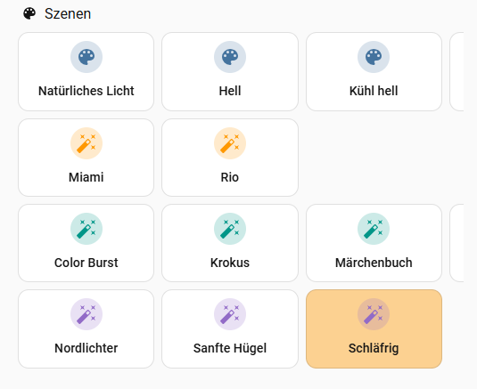
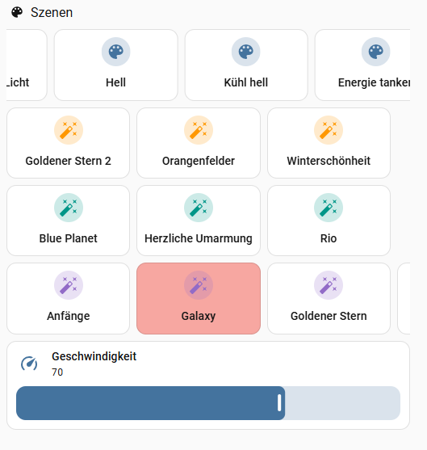

# Hue Scenes for Home Assistant

Control Philips **Hue dynamic scenes** from a Lovelace dashboard, adjust their
speed, and — the hard part — **know which scene is currently active** in each
room, even when it was started from the Hue app or a wall switch.

Home Assistant does not tell you which Hue scene is active. This project fills
that gap by *fingerprinting* each scene's light state and matching the live
lights against those fingerprints. The result is written to a
`pyscript.scene_tracker` entity and used to highlight the active scene on the
dashboard.

> Status: working config bundle (not a one-click integration). It grew out of a
> personal setup, so expect to adapt a few things to yours — see
> [Adapting to your setup](#adapting-to-your-setup).

## Screenshots

| Active scene highlighted | Dynamic scene + speed slider |
|---|---|
|  |  |

The running scene is marked automatically — **orange** for a static scene,
**red** for a dynamic one — even when it was started from the Hue app. The
speed slider only appears while a dynamic scene is playing, and the wand icon
marks scenes that support dynamic mode.

## Features

- **Scene tiles per room** in three brightness tiers, with a curated top row of
  the standard scenes.
- **Active-scene highlight** — the running scene is marked (orange = static,
  red = dynamic), including scenes started outside Home Assistant.
- **Dynamic scenes** — double-tap a tile to start it dynamically; a speed slider
  appears only while dynamic is running and is preset to the scene's own speed.
- **Self-maintaining database** — every time you tap a scene its fingerprint is
  re-learned, so edits and new scenes are picked up automatically.
- **Remote-friendly** — a `scene_cycle` script steps through scenes in dashboard
  order for a physical button.
- **Global template** — one dashboard definition, one line (`room:`) per room.

## How it works

1. `scene_fingerprint_calibrate` (pyscript) activates each room scene once and
   records the resulting per-light state (`brightness` + `color_temp` or `xy`,
   **including which member lights stay off**) into
   `/config/scene_fingerprints.json`. That off/on subset is what tells apart
   scenes lighting up different parts of a group (e.g. *gedimmt Diele* vs
   *gedimmt kleiner Flur*).
2. `scene_match.py` runs a small loop that compares the live lights of each room
   against the fingerprints and writes the best match to
   `pyscript.scene_tracker` (attribute `active_scene`, a `{room: scene}` map).
3. The dashboard reads that map (plus `input_text.dynamic_scenes` and
   `sensor.dynamische_szenen`) to colour the tiles.

## Requirements

- Home Assistant with the official **Philips Hue** integration.
- **pyscript** (HACS) with `allow_all_imports: true`.
- HACS frontend cards: **config-template-card**, **swipe-card**, **card-mod**,
  **decluttering-card**.
- A **light group per room** whose `entity_id` attribute lists the room's
  member lights, named `light.dimmer_<slug>` (configurable, see below).

## Install

1. **pyscript** — in `configuration.yaml`:
   ```yaml
   pyscript:
     allow_all_imports: true
     hass_is_global: true
   ```
   Copy `pyscript/scene_fingerprints.py` and `pyscript/scene_match.py` to
   `/config/pyscript/`.
2. **Backend** — copy `packages/hue_scenes.yaml` to `/config/packages/`
   (enable packages) or merge its blocks into your config.
3. **Frontend** — put the `decluttering_templates:` block from
   `lovelace/decluttering_template.yaml` at the top level of your dashboard's
   raw config, then add one card per room (see `lovelace/example_room.yaml`).
4. Restart Home Assistant.

## Calibrate

Developer Tools → Actions:

```yaml
action: pyscript.scene_fingerprint_calibrate      # whole home
# or a single room:
action: pyscript.scene_fingerprint_calibrate
data:
  room: Wohnzimmer
```

The lights flash briefly through every scene. After that the tracker fills
within a few seconds and stays fresh on its own (learn-on-tap).

For a dashboard-friendly version, add `lovelace/calibration_card.yaml` — a
room picker (or "Alle Räume") with a **Kalibrieren** button and a live status
line fed by the `pyscript.calibration` entity.

## Per-room setup

For each room:

- one card: `- room: <group_name>` (see `example_room.yaml`)
- one speed helper line: `<slug>_dynamic_speed: *dyn_speed`
- one speed-automation trigger line: `- input_number.<slug>_dynamic_speed`

List the exact room names with:

```jinja
{{ states.scene | map(attribute='attributes.group_name') | reject('none') | unique | list }}
```

## Adapting to your setup

- **Room light group naming** — the code finds a room's lights via
  `GROUP_PREFIX + slugify(room)` (default `light.dimmer_`). Change `GROUP_PREFIX`
  in both pyscript files, or adapt them to resolve lights from the room's area.
- **Standard scene names** — block 1 recognises the standard scenes by name
  (`Hell`, `Kühl hell`, …). Adjust the `NAMED` list in the template for your
  language.
- **Entity names** are German (`sensor.dynamische_szenen`, …) to match the
  bundle; rename freely, but keep them consistent across pyscript, package and
  dashboard.

## Known limitations

Fingerprint matching is inherently approximate:

- **Identical scenes** (same colours/brightness) can't be told apart.
- **Gradient / multi-colour lights** report a single averaged colour, so scenes
  relying on them match less reliably.
- **Dynamic scenes** cycle their colours; they are detected as "dynamic running"
  via the light attribute, not fingerprinted.
- **Shared lights** that belong to two rooms are fine: a member currently
  running a dynamic palette (e.g. a light playing a dynamic scene for another
  room) is treated as a wildcard, so it can't drag a room's static match off.
- **Adaptive scenes** like *Natural Light* drift over the day and are excluded
  from matching (`EXCLUDE_SUFFIXES`).

## License

MIT — see [LICENSE](LICENSE).
